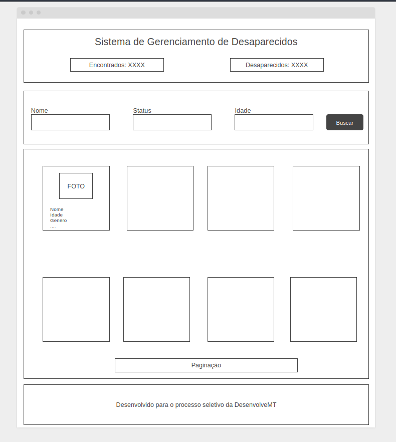
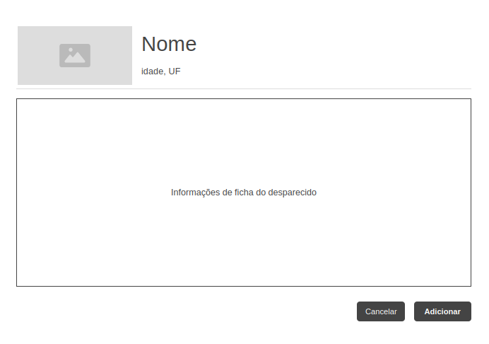

# Sistema de Busca de Pessoas Desaparecidas (SBPD) - Frontend

Este projeto foi desenvolvido como parte do processo seletivo da **Desenvolve MT** e consiste na criação de uma Single Page Application (SPA) para consultar e interagir com a API de pessoas desaparecidas da Polícia Judiciária Civil de Mato Grosso.

**Link para o Deploy:** [https://abitus-api-fe.vercel.app/](https://abitus-api-fe.vercel.app/)

---

## Resumo dos Requisitos Atendidos

A aplicação foi construída em **TypeScript** utilizando **Next.js** como framework base. 
Os requisitos do projeto, presentes no livro-texto e implementados, são detalhados abaixo.

### Requisitos Gerais

* **Rotas com Lazy Loading:** A arquitetura do Next.js App Router foi utilizada, garantindo o code-splitting e o carregamento sob demanda para cada rota, otimizando a performance inicial.
* **Design Limpo e Intuitivo:** A interface foi projetada com foco na clareza e facilidade de uso, seguindo uma identidade visual consistente.
* **Containerização com Docker:** A aplicação é containerizada, com os scripts `Dockerfile` e `docker-compose.yml`.
* **Tratamento de Erros de Requisição:** O sistema possui um tratamento de erros por meio das notificações "toast" para falhas de interatividade e páginas de erro dedicadas para falhas críticas de carregamento no servidor.

### Requisitos Específicos

* **Tela Inicial:**
    * Exibe cards com foto, dados e status ("Desaparecida" ou "Localizada").
    * Implementa paginação, carregando 12 registros por página.
    * Disponibiliza um menu de busca avançada com filtros suportados pela API.
* **Detalhamento do Registro:**
    * Ao clicar em um card, o usuário navega para uma página de detalhes (`/pessoa/[id]`) com uma ficha completa de informações.
    * O status "Desaparecida" ou "Localizada" é visualmente destacado na página de detalhes.
* **Envio de Informações:**
    * A página de detalhes contém um botão que abre um formulário modal para o cidadão registrar novas informações.
    * O formulário permite anexar fotos e indicar a localização onde a pessoa foi avistada.
    * O campo de data possui validação para não aceitar datas futuras e máscara de data.

## Tecnologias Utilizadas

* **Framework:** [Next.js](https://nextjs.org/)
* **Biblioteca Base:** [React](https://react.dev/)
* **Linguagem:** [TypeScript](https://www.typescriptlang.org/)
* **Estilização:** [Tailwind CSS](https://tailwindcss.com/)
* **Comunicação com a API:** [Axios](https://axios-http.com/)
* **UI e Animações:** [Framer Motion](https://www.framer.com/motion/) & [React Hot Toast](https://react-hot-toast.com/)
* **Testes:** [Vitest](https://vitest.dev/) & [React Testing Library](https://testing-library.com/)
* **Containerização:** [Docker](https://www.docker.com/)
* **Deployment & CI/CD:** [Vercel](https://vercel.com/)

## Rodando o Projeto Localmente com Docker

Esta seção contém o passo a passo para instalação e execução do projeto.

### Pré-requisitos
- [Git](https://git-scm.com/)
- [Docker](https://www.docker.com/products/docker-desktop/) e Docker Compose

### Passos para a Execução

1.  **Clone o Repositório:**
    ```bash
    git clone https://github.com/caiocvalerio/abitus-api-fe.git
    cd abitus-api-fe
    ```

2.  **Crie o Arquivo de Ambiente:**
    Copie o arquivo de exemplo para criar sua configuração local.
    ```bash
    cp .env.example .env
    ```

3.  **Construa e Inicie o Container:**
    Este comando irá construir a imagem da aplicação e iniciar o container.
    ```bash
    docker compose up --build
    ```

4.  **Acesse a Aplicação:**
    A aplicação estará disponível em [http://localhost:3000](http://localhost:3000).

### Como Rodar os Testes
O script do `Dockerfile` já vem incluso com os testes antes do build. 
Para executar a suíte de testes na pasta raiz do projeto, use o seguinte comando:

```bash
npm test
```

## Diário de Desenvolvimento e Decisões do Projeto

Esta seção documenta o processo de desenvolvimento e as principais decisões de arquitetura tomadas.

### Desenvolvimento da interface
O desenvolvimento começou pela análise dos requisitos e a criação de wireframes básicos para o layout.

<div align="center">

**Página Principal**
*Layout planejado para a tela home, com o menu de filtros em cima e a grade de cards de resultados logo abaixo.*
<br>


---

**Página de Detalhes**
*Layout da ficha completa da pessoa, com destaque para a foto, informações pessoais e detalhes da ocorrência.*
<br>


</div>

Comecei o desenvolvimento seguindo os wireframes, mas à medida que o projeto evoluía e eu buscava inspirações de design, encontrei o site [Cadastro Nacional de Pessoas Desaparecidas](https://cnpd.mj.gov.br/painel-publico). Com base nisso, optei por pivotar o layout tradicional com header para um menu lateral, que é como o projeto está estruturado atualmente.

### Decisões de Arquitetura

* **Next.js:** Esta arquitetura implementa o Lazy Loading por rota automaticamente, o que foi um requisito do projeto. Cada página (como a `Home` e a de `Detalhes`) é compilada em um "pedaço" de código JavaScript independente. O navegador do usuário baixa apenas o código da página inicial e, quando ele navega para uma nova rota, o código daquela página específica é carregado sob demanda. Isso, combinado com o uso de **Componentes de Servidor** para a busca de dados inicial e **Componentes de Cliente** para toda a interatividade, cria uma experiência de usuário otimizada.

* **Proxy de API (`route.ts`):** Foi criada uma API Route para servir como um proxy para o endpoint de envio de informações. Essa decisão foi tomada para contornar a restrição de CORS da API externa.

* **Tratamento de dados:** Inicialmente, implementei no hook `usePessoas` alguns filtros adicionais sobre os dados retornados pela API. No entanto, após refletir, considerei que tais filtros se aproximavam mais de regras de negócio e, portanto, não deveriam ser responsabilidade da camada de apresentação. Ainda assim, deixo registrado que cheguei a desenvolvê-los:  

    * **Filtro de Nome (`startsWith`):**  
        * **Questão:** A API realiza uma busca do tipo "contém" (ex.: buscar por "Ana" também retornava "Mari**ana**").  
        * **Implementação:** No frontend, refinei a lista para exibir apenas resultados cujo nome **começava com** o termo pesquisado.  

    * **Filtro de Situação (`dataLocalizacao`):**  
        * **Questão:** Ao filtrar por `status=LOCALIZADO`, a API retornava registros de pessoas cujo campo `dataLocalizacao` estava nulo ou vazio.  
        * **Implementação:** Criei um filtro de segurança que só considerava alguém como "Localizada" se o campo `ultimaOcorrencia.dataLocalizacao` contivesse uma data válida.  

### Ambiente de produção

A aplicação foi implantada na Vercel utilizando uma pipeline de CI/CD simples. Sempre que ocorre uma atualização na branch `main`, a Vercel executa automaticamente os seguintes comandos:

```bash
    npm test && npm run build
```

Além disso, foi configurada a variável de ambiente referente à API da Abitus no ambiente da Vercel e o servidor foi ajustado para a região de São Paulo, conforme mencionado anteriormente.